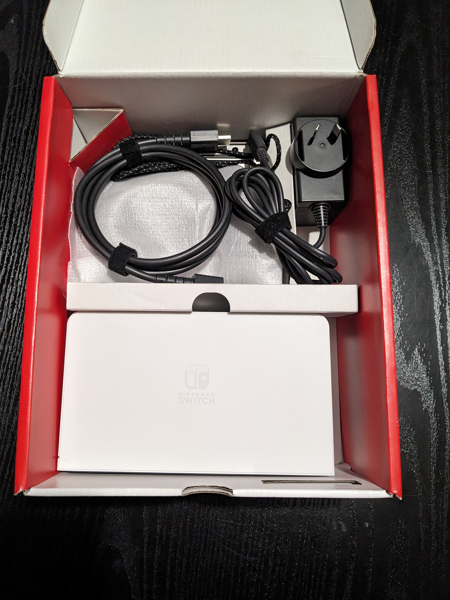

<head>
<style>
  .sliderbody {
    max-width: 750px;
    max-height: 550px;
    font-family: 'Lato', sans-serif;
  }

  .sliderbody h4{
    text-align: center;
    margin-left: -55px;
  }
  
  
  .carousel {
    position: relative;
    padding-top: 57%;
    filter: drop-shadow(0 0 10px #0003);
    perspective: 100px;
    margin: 0 auto;
    
  }

  li.carousel__slide::marker {
    color: var(--list-marker-color);
    font-size: 15px !important;
}
  
  .carousel__viewport {
    position: absolute;
    top: 0;
    right: 0;
    bottom: 0;
    left: 0;
    display: flex;
    overflow-x: scroll;
    counter-reset: item;
    scroll-behavior: smooth;
    scroll-snap-type: x mandatory;
    border-radius: 6px;
  }
  
  .carousel__slide {
    position: relative;
    flex: 0 0 100%;
    width: 100%;
    counter-increment: item;
  }
  
 
  .carousel__snapper section {
    margin: 0 auto;
  }

  .carousel__snapper {
    position: absolute;
    top: 0;
    left: 0;
    width: 100%;
    height: 100%;
    scroll-snap-align: center;
  }
  
  
  .carousel:hover .carousel__snapper,
  .carousel:focus-within .carousel__snapper {
    animation-name: none;
  }
 
  .carousel::before,
  .carousel::after,
  .carousel__prev,
  .carousel__next {
    position: absolute;
    top: 0;
    margin-top: 37.5%;
    width: 4rem;
    height: 4rem;
    transform: translateY(-50%);
    border-radius: 50%;
    font-size: 0;
    outline: 0;
  }
  </style>
</head>

# What can a modded console do?

*   Run homebrew applications
*   Stream games from your PC
*   Play backups of physical games
*   Dual boot to Android to run Android apps and games

# Prices

| Model       | Chip      | Price  |
|:------------|:----------|:-------|
| Unpatched   | RCMx86    | `$100` |
| Patched V1  | Instinct  | `$125` |
| Lite        | Instinct  | `$125` |
| OLED        | Instinct  | `$150` |
| Postage     |           | ` $20` |

# Links
[Items for sale on FB Marketplace](https://www.facebook.com/marketplace/profile/527145129)

[Items for sale on eBay](https://www.ebay.com.au/sch/i.html?_ssn=jimnastic89)

[Instagram](https://www.instagram.com/jdamods/)

[Link to SD card files](https://github.com/sthetix/HATS/releases/latest)

carousels:
  - images: 
    - image: ./assets/images/XTW70688_1.jpg
    - image: ./assets/images/XTW70688_2.jpg
    - image: ./assets/images/XTW70688_3.jpg
    - image: ./assets/images/XTW70688_4.jpg
    - image: ./assets/images/XTW70688_5.jpg

<div class="sliderbody">
<h4> Image-Slider</h4>
<section class="carousel" aria-label="Gallery">
  <ol class="carousel__viewport">
    <li id="carousel__slide1"
        tabindex="0"
        class="carousel__slide">
      <div class="carousel__snapper"> 
	      <section class="internal-embed" src="./assets/images/XTW70688_1.jpg"></section>
      </div>
        <a href="#carousel__slide4"
           class="carousel__prev">Go to last slide</a>
        <a href="#carousel__slide2"
           class="carousel__next">Go to next slide</a>
    </li>
    <li id="carousel__slide2"
        tabindex="0"
        class="carousel__slide">
      <div class="carousel__snapper">
            <section class="internal-embed" src="./assets/images/XTW70688_1.jpg"></section> </div>
      <a href="#carousel__slide1"
         class="carousel__prev">Go to previous slide</a>
      <a href="#carousel__slide3"
         class="carousel__next">Go to next slide</a>
    </li>
    <li id="carousel__slide3"
        tabindex="0"
        class="carousel__slide">
      <div class="carousel__snapper">
            <section class="internal-embed" src="./assets/images/XTW70688_1.jpg"></section></div>
      <a href="#carousel__slide2"
         class="carousel__prev">Go to previous slide</a>
      <a href="#carousel__slide4"
         class="carousel__next">Go to next slide</a>
    </li>
    <li id="carousel__slide4"
        tabindex="0"
        class="carousel__slide">
      <div class="carousel__snapper">
            <section class="internal-embed" src="./assets/images/XTW70688_1.jpg"></section></div>
      <a href="#carousel__slide3"
         class="carousel__prev">Go to previous slide</a>
      <a href="#carousel__slide5"
         class="carousel__next">Go to first slide</a>
    </li>
    <li id="carousel__slide5"
        tabindex="0"
        class="carousel__slide">
      <div class="carousel__snapper">
            <section class="internal-embed" src="./assets/images/XTW70688_1.jpg"></section></div>
      <a href="#carousel__slide4"
         class="carousel__prev">Go to previous slide</a>
      <a href="#carousel__slide6"
         class="carousel__next">Go to first slide</a>
    </li>
  </ol>
</section>
</div>

<!---




--->

{::comment}

Text can be **bold**, _italic_, or ~~strikethrough~~.

This is a normal paragraph following a header.

## Header 2

> This is a blockquote following a header.
>
> When something is important enough, you do it even if the odds are not in your favor.

### Header 3

```js
// Javascript code with syntax highlighting.
var fun = function lang(l) {
  dateformat.i18n = require('./lang/' + l)
  return true;
}
```

```ruby
# Ruby code with syntax highlighting
GitHubPages::Dependencies.gems.each do |gem, version|
  s.add_dependency(gem, "= #{version}")
end
```

##### Header 5

1.  This is an ordered list following a header.
2.  This is an ordered list following a header.
3.  This is an ordered list following a header.

### There's a horizontal rule below this.

* * *

### And an ordered list:

1.  Item one
1.  Item two
1.  Item three
1.  Item four

### And a nested list:

- level 1 item
  - level 2 item
  - level 2 item
    - level 3 item
    - level 3 item
- level 1 item
  - level 2 item
  - level 2 item
  - level 2 item
- level 1 item
  - level 2 item
  - level 2 item
- level 1 item


### Definition lists can be used with HTML syntax.

<dl>
<dt>Name</dt>
<dd>Godzilla</dd>
<dt>Born</dt>
<dd>1952</dd>
<dt>Birthplace</dt>
<dd>Japan</dd>
<dt>Color</dt>
<dd>Green</dd>
</dl>

```
Long, single-line code blocks should not wrap. They should horizontally scroll if they are too long. This line should be long enough to demonstrate this.
```

```
The final element.
```
{:/comment}
