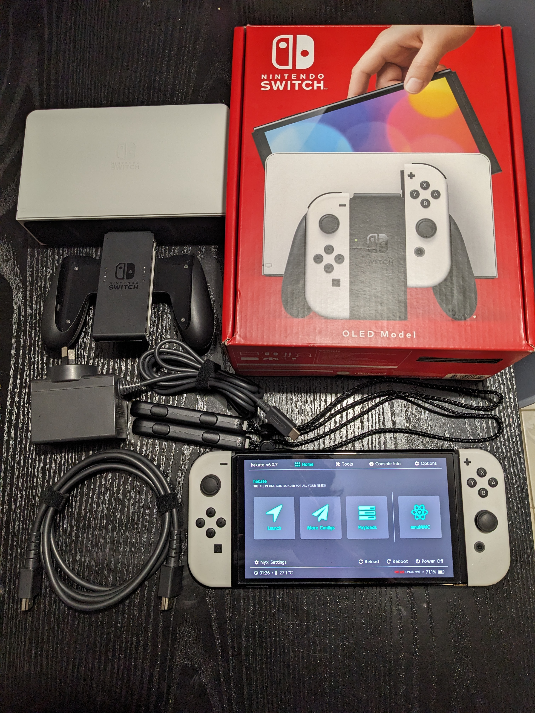
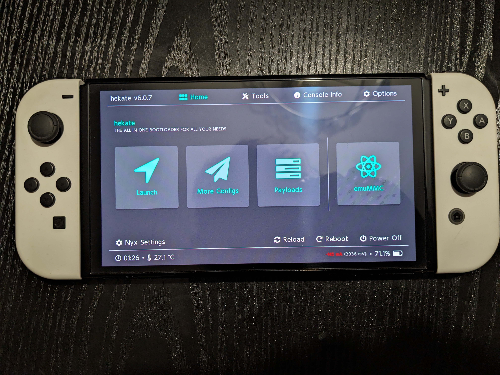
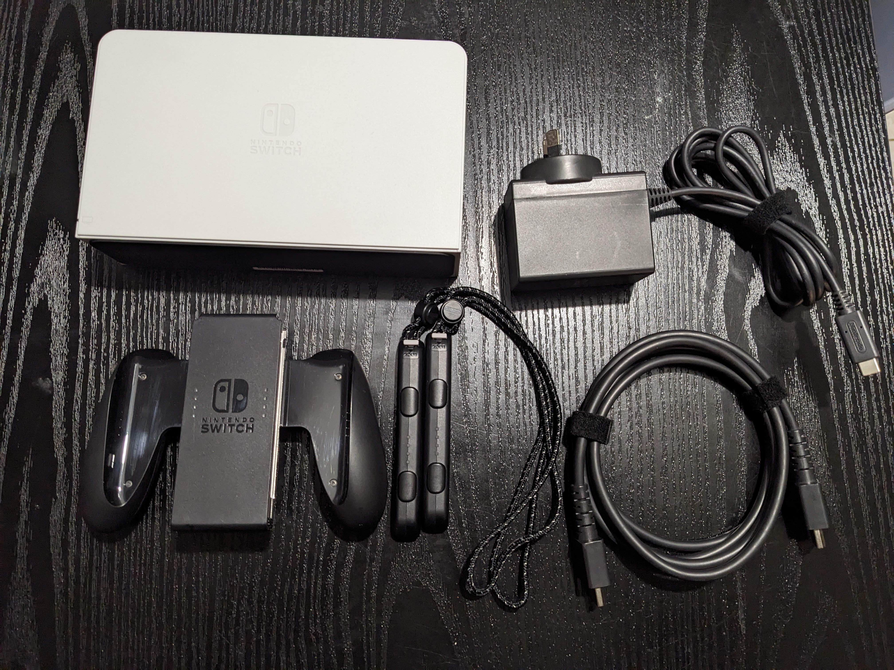
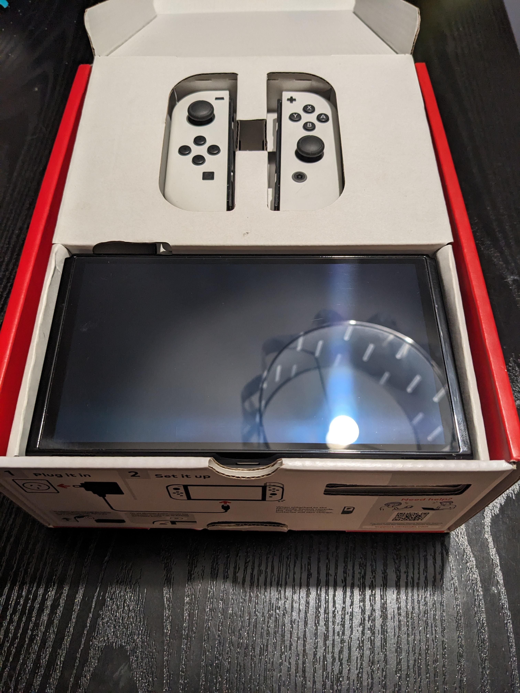

# What can a modded console do?

*   Run homebrew applications
*   Stream games from your PC
*   Play backups of physical games
*   Dual boot to Android to run Android apps and games

# Prices

| Model       | Chip      | Price  |
|:------------|:----------|:-------|
| Unpatched   | RCMx86    | `$100` |
| Patched V1  | Instinct  | `$125` |
| Lite        | Instinct  | `$125` |
| OLED        | Instinct  | `$150` |
| Postage     |           | ` $20` |

# Links
[Items for sale on FB Marketplace](https://www.facebook.com/marketplace/profile/527145129)

[Items for sale on eBay](https://www.ebay.com.au/sch/i.html?_ssn=jimnastic89)

[Instagram](https://www.instagram.com/jdamods/)

[Link to SD card files](https://github.com/sthetix/HATS/releases/latest)

{% include carousel.html height="50" unit="%" duration="7" number="1" %}

{% include carousel.html height="50" unit="%" duration="7" number="2" %}

{% include carousel.html height="50" unit="%" duration="7" images=carousel_images %}

{% include carousel.html height="50" unit="%" duration="7" images=carousel_images %}

carousel_images: [./assets/images/XTW70688_1.jpg, ./assets/images/XTW70688_2.jpg, ./assets/images/XTW70688_3.jpg]


{% include carousel.html height="50" unit="%" duration="7" number="1" %}

{% include carousel.html height="50" unit="%" duration="7" number="2" %}

{% include carousel.html height="50" unit="%" duration="7" images=carousel_images %}

{% include carousel.html height="50" unit="%" duration="7" images=carousel_images %}







{::comment}

Text can be **bold**, _italic_, or ~~strikethrough~~.

This is a normal paragraph following a header.

## Header 2

> This is a blockquote following a header.
>
> When something is important enough, you do it even if the odds are not in your favor.

### Header 3

```js
// Javascript code with syntax highlighting.
var fun = function lang(l) {
  dateformat.i18n = require('./lang/' + l)
  return true;
}
```

```ruby
# Ruby code with syntax highlighting
GitHubPages::Dependencies.gems.each do |gem, version|
  s.add_dependency(gem, "= #{version}")
end
```

##### Header 5

1.  This is an ordered list following a header.
2.  This is an ordered list following a header.
3.  This is an ordered list following a header.

### There's a horizontal rule below this.

* * *

### And an ordered list:

1.  Item one
1.  Item two
1.  Item three
1.  Item four

### And a nested list:

- level 1 item
  - level 2 item
  - level 2 item
    - level 3 item
    - level 3 item
- level 1 item
  - level 2 item
  - level 2 item
  - level 2 item
- level 1 item
  - level 2 item
  - level 2 item
- level 1 item


### Definition lists can be used with HTML syntax.

<dl>
<dt>Name</dt>
<dd>Godzilla</dd>
<dt>Born</dt>
<dd>1952</dd>
<dt>Birthplace</dt>
<dd>Japan</dd>
<dt>Color</dt>
<dd>Green</dd>
</dl>

```
Long, single-line code blocks should not wrap. They should horizontally scroll if they are too long. This line should be long enough to demonstrate this.
```

```
The final element.
```
{:/comment}
